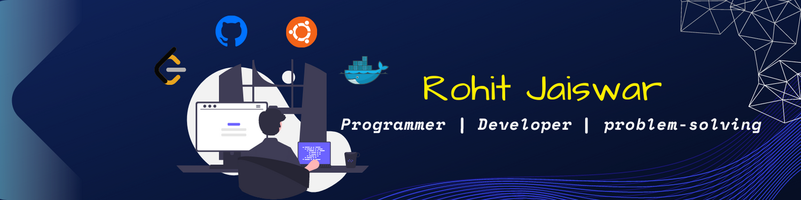

<h1 align="center">Hi 👋, I'm Rohit Jaiswar</h1>
<h3 align="center">I'm currently pursuing my Computer Science Engineering from India. A passionate Full-stack developer and Machine Learning Enthusiast. Extremely driven by a passion for code and building tech stuff.</h3>
 

  

  

- 🌱 I’m currently learning **"React" "Web3"**

- 💬 Ask me about **"MERN"**

- 📫 How to reach me **rjrohit1306@gmail.com**

- 📄 Know about my experiences [Resume](https://drive.google.com/file/d/1lqz6OM7SpP6SYFFaTGPPdPBZ49tXqln7/view?usp=sharing)
 

<h3 align="left">Connect with me:</h3>

<h3 align="left">Languages and Tools:</h3>

                                   

&nbsp;

&nbsp;

&nbsp;

